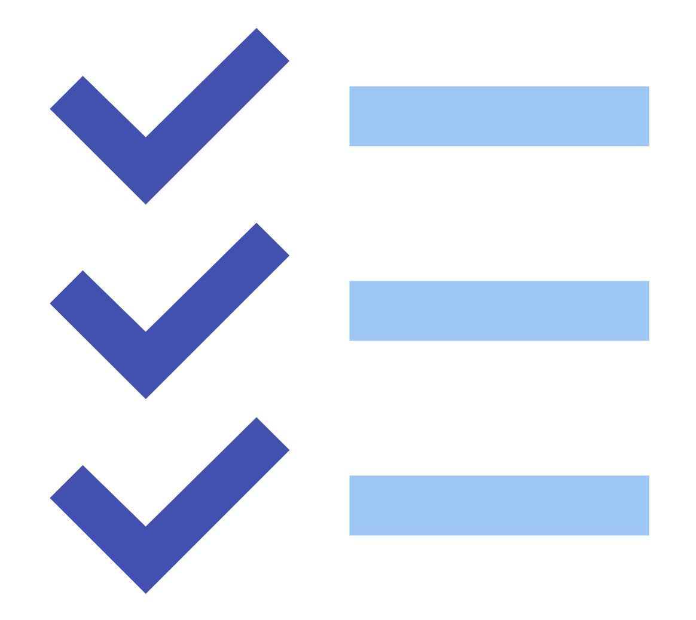
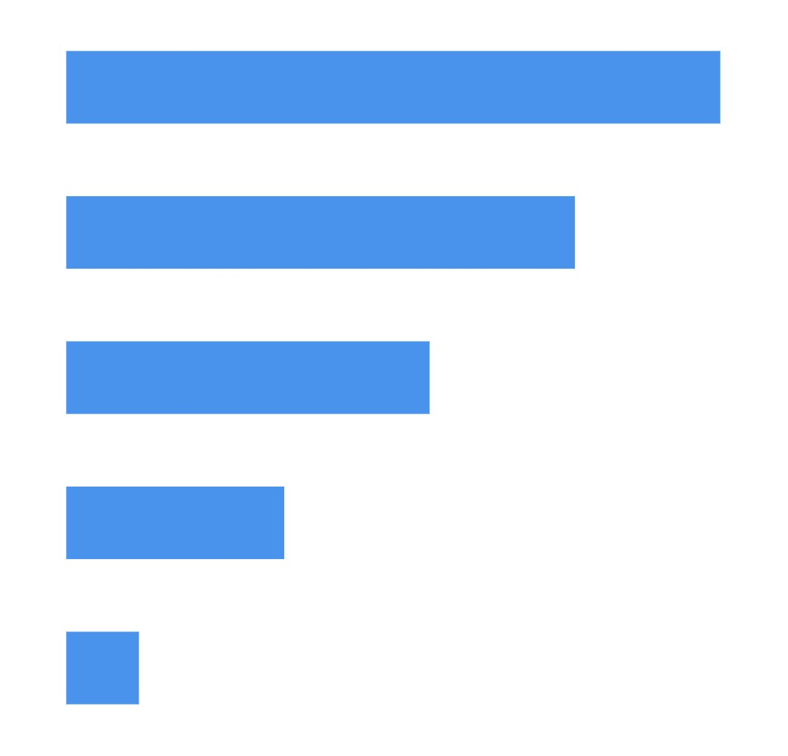

<div align="center">
  
  <br style="margin-bottom: 0.25em;">
</div>
<br>

# DevTrack app - IrRadiare
   <br>

Irradiare's DevTrack App is an internal tool designed to **monitor the performance and efficiency** of the company’s implemented projects over time, utilizing key indicator data. In addition to tracking, the app facilitates **forecasting project outcomes**, enabling the company to optimize the timing of new initiatives based on predicted values for these indicators.<br><br>
Project impact can be analyzed across **multiple geographical levels**, including parishes, municipalities, districts, and the national level. Additionally, the app supports tracking indicators based on NUTS (Nomenclature of Territorial Units for Statistics) levels.<br><br>
The app's database is populated with indicator data sourced from [E-REDES](https://e-redes.opendatasoft.com/explore/?sort=modified), [Eurostat](https://ec.europa.eu/eurostat/data/database), [INE](https://www.ine.pt/xportal/xmain?xpid=INE&xpgid=ine_api&INST=322751522), and [The World Bank](https://datahelpdesk.worldbank.org/knowledgebase/articles/889392-about-the-indicators-api-documentation).


<br>
<h2>
   
  <span style="vertical-align: middle;">Requirements</span>
</h2>

```
pip install -r requirements.txt
```
> It is recommended to set up a virtual environment (venv) first.
<br>

<h2>
   
  <span style="vertical-align: middle;">Table of Contents</span>
</h2>

[Summary](#summary)

[Folders and files](#folders-and-files)

[Instructions](#instructions)

[Upcoming Steps](#upcoming-steps)

<br>

<h2 id="summary">
   
  <span style="vertical-align: middle;">Summary</span>
</h2>

The development of the DevTrack App is driven by Irradiare's **strategic commitment to leveraging data for more informed decision-making**. As the company continues to implement diverse projects, it has become increasingly important to have a precise, data-driven summary of project evolution over time.<br>
By integrating key economic, social, and environmental indicators, the app provides a comprehensive view of project performance and potential.<br>
Furthermore, the ability to forecast these indicators offers the company valuable insights into the future impact of its initiatives, allowing for better prioritization of upcoming projects. This data-backed approach enables the company to assess, with greater accuracy, which projects to bid on next, ensuring more logical, safer, and efficient project selection and execution.<br>
The flexibility to connect various dimensions of performance within the app strengthens decision-making, fostering an optimized, strategic, and long-term perspective for the company's future initiatives.

> SQLite for the database creation (currently).

> As explained in the docs for each data source, many different data retrieval and processing techniques were applied.

<br>
<div align="center">
  
  <br style="margin-bottom: 0.25em;">
  <sub>DevTrack App's data pathway</sub>
</div>
<br>

<br>

<h2 id="folders-and-files">
   
  <span style="vertical-align: middle;">Folders and files</span>
</h2>

**[app](/app)**: Folder containing all the logic for the application.
  - **[api](/api)**: Folder containing all the scripts needed to set up the FastAPI project.
  - **[db](/db)**: Folder containing the logic needed to create and fill the database of the app once the data is already extracted, processed and saved.
  - **[indicators_data](/indicators_data)**: This folder contains the scripts required for extracting and transforming data, organized by data source. Each dedicated subfolder includes a corresponding .md file redirecting to additional detailed Readme files available in the [docs](/docs) section. These Readme files provide step-by-step explanations of the processes followed for each data source.
  - **[utils](/utils)**: This folder contains various files that are reused throughout the application. It includes both one-time-use scripts and supplementary information that is valuable for a deeper understanding of the project.

**[docs](/docs)**: Folder for documentation and images.

**Other files**:
- **.gitignore**: Specifies the files that are present in the local repository but not in the remote version.
- **requirements.txt**: Needed libraries to execute the program. *It is important to have them all installed.*
- **.gitattributes**: Ensures consistent line endings across different platforms in the project. It automatically converts text files to native line endings (CRLF for Windows, LF for Unix), while specifying that certain file types, like .sh and .csv, always use LF, and .bat files always use CRLF. This prevents line-ending issues and keeps the project consistent across environments.
<br>

<br>
<h2 id="instructions">
   
  <span style="vertical-align: middle;">Instructions</span>
</h2>

To set up the application and proceed with execution, check [here](/docs/Quick_Start.md).
<br>

<br>
<h2 id="upcoming-steps">
   
  <span style="vertical-align: middle;">Upcoming steps</span>
</h2>

Upcoming Steps to be Implemented:
  - **Enhancing the API**: Adding more endpoints to improve functionality.
  - **Tagging Indicators**: Implementing tag values for better categorization of indicators.
  - **User Permissions**: Establishing exclusive permissions for specific users based on their department and type of indicator.
  - **Database Migration**: Migrating the application to use a PostgreSQL database instead of SQLite.
  - **Forecasting Integration**: Connecting the database to forecasting methods, potentially using R or Python, to populate the database with parameters such as forecasted_Value, which are currently absent.

