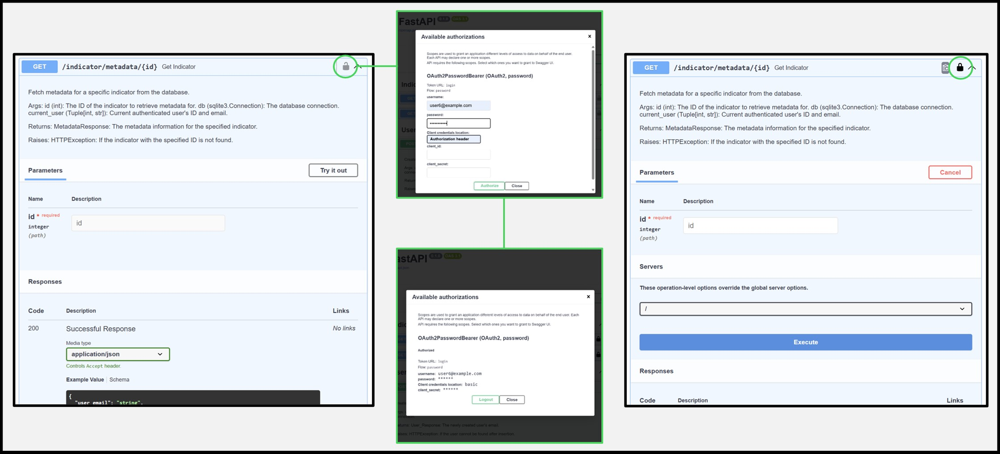

# API guide
This guide provides instructions for setting up the FastAPI API for this application and demonstrates how to make requests to the database effectively.

> [!NOTE]  
> Although the API has been successfully tested in Postman, the data querying process will be detailed using the documentation generated by FastAPI (Swagger).

---
## API Setup
As the API developed for this application includes a user validation method implemented through **JSON Web Tokens (JWT)**, it is essential to complete a preliminary step before starting the server.<br>
This step will ensure a correct and secure data retrieval from the database.

It is needed to create a new file named `.env` in the [api](/app/api) folder.<br>
In Python, a *.env* file is commonly used to store configuration settings, API keys, and other sensitive information.<br><br>
In this case, there will be just **three key-value pairs needed as environmental variables** required for a correct user validation through JWT, named:

- **ALGORITHM**: Encryption Algorithm used to encrypt input data. As the application was developed consuming JWTs, it is safe to use HS256, because you will have control on who uses the secret keys.
- **SECRET_KEY**: Needed for a standard HS256 encryption for the signature, the secret should at least be 32 characters long, but the longer the better.
- **TOKEN_EXPIRATION_MINUTES**: Configuration parameter that defines how long (in minutes) a generated token remains valid before it expires. Number of minutes allowed per user session.

<br>

The `.env` file could be similar to:

```
SECRET_KEY = 64 characters long key
ALGORITHM = HS256
TOKEN_EXPIRATION_MINUTES = 20
```

<br>
For the secret key generation, it is possible to use the Python's `secrets` module:
<br>

```
import secrets
# Generate a 64-character long random secret key
SECRET_KEY = secrets.token_hex(32)  # 32 bytes = 64 hex characters
print("Generated Secret Key:", SECRET_KEY)
```

<br>

Once the *.env* file is saved, it is possible to run a local server by executing the following command line:

```
uvicorn app.api.main:app --reload
```

<br>
If the setting up process was done correctly, the following message will appear in the terminal:

```
(venv) PS C:\path\to\irradiare-app> uvicorn app.api.main:app --reload
INFO:     Will watch for changes in these directories: ['C:\\path\\to\\irradiare-app']
INFO:     Uvicorn running on http://127.0.0.1:8000 (Press CTRL+C to quit)
INFO:     Started reloader process [15472] using WatchFiles
INFO:     Started server process [25876]
INFO:     Waiting for application startup.
INFO:     Application startup complete.
INFO:     Shutting down
INFO:     Waiting for application shutdown.
INFO:     Application shutdown complete.
INFO:     Finished server process [25876]
INFO:     Stopping reloader process [15472]
```

<br>

The message "Uvicorn running on http://127.0.0.1:8000" indicates that a FastAPI or ASGI application is running locally on your machine. The idea will be to check out the FastAPI generated docs by entering the given URL and adding /docs at the end.<br>
Swagger UI is accessible at /docs by default and provides a graphical interface for users to explore the API. It is possible to see available endpoints, their request methods, parameters, and response formats.
<br><br>

The data extraction process requires an authenticated user, meaning that a user must already exist in the database. To create a user, navigate to the API documentation site (Swagger UI) and use the endpoint under the "User" tag, as shown in the image below.
<br>
<div align="center">
  
  <br>
  <sub>Create User Endpoint</sub>
</div>

<br>
Once the user is registered, the next step is logging in or validating the user before any data can be retrieved. During the login process, a JWT (JSON Web Token) is generated upon successful authentication. This token temporarily verifies the user's identity.<br><br>

To interact with the API and retrieve data, you must provide the JWT for authorization. In the API documentation, this can be done by clicking the padlock icon located in the upper right corner of each endpoint. After entering the user credentials (username and password), a JWT token is issued. With this token, you are authorized to interact with the endpoints and retrieve data from the database.
<br>
<div align="center">
  
  <br>
  <sub>User Authorization</sub>
</div>
<br>


