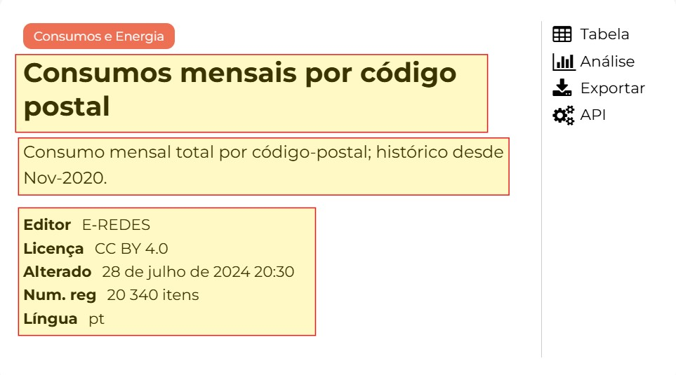

# E-REDES Data Pathway


>External files involved along the process:
  >- [dicofre.json](../app/utils/loc_codes/dicofre.json) (Modified version. Original source: [freguesias-metadata.json](https://dados.gov.pt/pt/datasets/freguesias-de-portugal/) )
  >- [zipcodes.json](../app/utils/loc_codes/zipcodes.json) (Modified version. Original source: [CP7_Portugal_nov2022.txt](https://github.com/temospena/CP7/tree/master/CP7%20Portugal) )
  >- [NUTS.json](../app/utils/nuts_levels/NUTS.json) (Proprietary file. Created based on the following article: [List of regions and sub-regions of Portugal](https://en.wikipedia.org/wiki/List_of_regions_and_sub-regions_of_Portugal) )
> 
> More information about the modified files and the modification process [here](../app/utils/Readme.md).

<br>
This document is a guide that describes how data for indicators is obtained from the E-REDES Open Data Portal, as well as the processes for completing and cleaning this data.

---
## Isolated execution
To execute the data extraction and transformation scripts in order to obtain a set of data files ready to be inserted into the database, input the following commands in the terminal:

Set the current directory to the eredes folder:
```
cd /path/to/irradiare_app/app/indicators_data/eredes
```

Execute the main script:
```
python main.py
```

---

## Process sequence
Brief description of E-REDES data lifecycle:

  1. The data is downloaded using dynamic web scraping on the [E-REDES Open Data Portal](https://e-redes.opendatasoft.com/explore/?sort=modified) site using the 'Selenium' library. The process involves navigating to the 'Download' tab on each indicator's page and executing the download link to retrieve the data in CSV format. *One CSV file is obtained per indicator*.

  
  2. The required metadata is extracted by web scraping the metadata from each indicator's interactive card. *All the metadata is compiled into a single file for all the indicators*.


  <div align="center">
    
    <br>
    <sub>Indicator's card metadata (example)</sub>
  </div>
  
  <br>
  
  3. The indicator data files are merged with their corresponding metadata from the previously generated metadata file, creating a **temporary** file for each indicator. The matching process is based on the source code name (src_code).


  4. The data in the temporary merged files is completed by adding time and geolocation information. After this enhancement, a final data file is generated for each indicator, and the corresponding temporary files are **deleted**. <br>
     - A **timecode** is added based solely on the data from the file itself (columns such as date, year, month, etc.). <br><br>
     
     > [!NOTE]
     > The timecode structure follows a logical sequence:
     
       + YYYY: Year only (4 digits)
       + YYYYMM: Year + Month (6 digits)
       + YYYYMMDD: Year + Month + Day (8 digits)
       + *Any previous combination* + S*X*: S followed by a digit shows the semester of the year
       + *Any previous combination* + Q*X*: Q followed by a digit shows the quarter of the year
 
     - **Geolocation data (distrito, concelho, freguesia, and NUTS I, II, III)** is extracted from the `dicofre.json`, `zipcodes.json`, and `NUTS.json` files. <br>
     For each record in the data file, there is a column with either a dicofre or zipcode number (normally, one is present while the other is not).
     Each value in this column is matched totally or partially with the corresponding entry in the dicofre or zipcode files, this match provides information about the distrito, concelho, and freguesia. <br>
     Using the concelho, it is possible to determine the NUTS I, II, and III regions. If the concelho is not available because the zipcode or dicofre is too short, a partial match is performed to extract at least the NUTS I and II levels, or just the NUTS I level.

  
  5. The raw data files are never deleted but are replaced each time the data extraction script is executed.

---

## E-REDES Folder Structure:
The  folder structure before executing the program is as it follows:

```
eredes
    |
    +- data_extraction ............. --> Code to retrieve data and metadata
    |   |
    |   +- eredes_data.py .......... --> Code to retrieve data from E-REDES data source
    |   |
    |   +- eredes_metadata.py ...... --> Code to retrieve metadata related to each data file
    |
    +- data_processing ............. --> Code to merge, clean, and complete the raw data files
    |   |
    |   +- eredes_final_format.py .. --> Code to clean and complete data files
    |   |    
    |   +- eredes_merge_files.py ... --> Code to merge each data file with its corresponding metadata
    |
    +- main.py ..................... --> Main script to execute the full E-REDES data process
```

After running the program, the resulting directory structure, excluding the temporary folder (which is deleted during execution and used to hold files generated from merging raw data files with their metadata), is as follows:

```
eredes
    |
    +- data ........................ --> Holds processed and unprocessed data files
    |   |
    |   +- processed  .............. --> Processed data files.
    |   |
    |   +- raw  .................... --> Unprocessed data files.
    |
        +- data_extraction ............. --> Code to retrieve data and metadata
    |   |
    |   +- eredes_data.py .......... --> Code to retrieve data from E-REDES data source
    |   |
    |   +- eredes_metadata.py ...... --> Code to retrieve metadata related to each data file
    |
    +- data_processing ............. --> Code to merge, clean, and complete the raw data files
    |   |
    |   +- eredes_final_format.py .. --> Code to clean and complete data files
    |   |    
    |   +- eredes_merge_files.py ... --> Code to merge each data file with its corresponding metadata
    |
    +- main.py ..................... --> Main script to execute the full E-REDES data process
    |
    +- metadata  ................... --> Contains the extracted metadata file
        |
        +- eredes_final_format  .... --> Metadata file
```

<br>

[](https://skillicons.dev)  The `processed` data is selected and inserted into the SQLite database. Source code in /database (referenciar).

