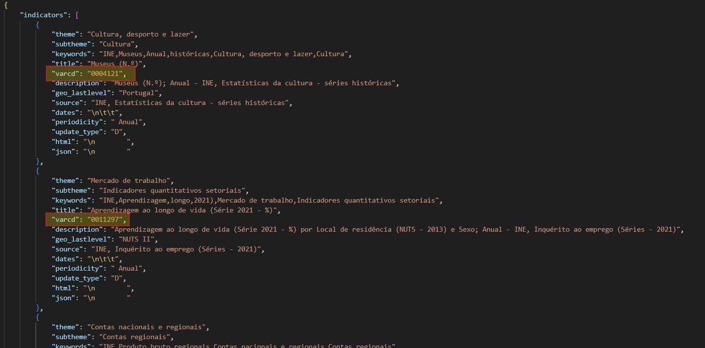
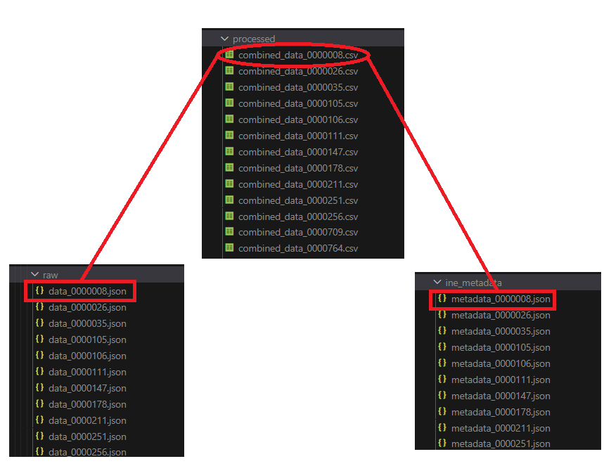
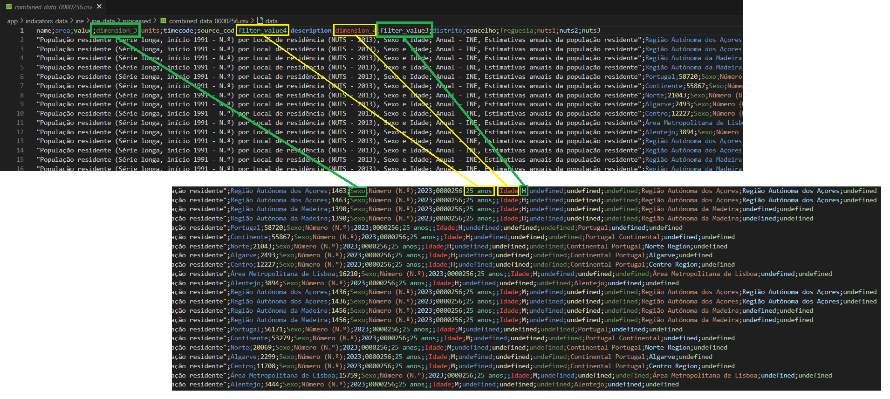

<br>
<div align="center">
  
</div>

# INE Data Pathway


>External files involved along the process:
  >- [dicofre.json](../app/utils/loc_codes/dicofre.json) (Modified version. Original source: [freguesias-metadata.json](https://dados.gov.pt/pt/datasets/freguesias-de-portugal/) )
  >- [zipcodes.json](../app/utils/loc_codes/zipcodes.json) (Modified version. Original source: [CP7_Portugal_nov2022.txt](https://github.com/temospena/CP7/tree/master/CP7%20Portugal) )
  >- [NUTS.json](../app/utils/nuts_levels/NUTS.json) (Proprietary file. Created based on the following article: [List of regions and sub-regions of Portugal](https://en.wikipedia.org/wiki/List_of_regions_and_sub-regions_of_Portugal) )
> 
> More information about the modified files and the modification process [here](../app/utils/Readme.md).

<br>
This document is a guide that describes how data for indicators is obtained from the INE Database, as well as the processes for completing and cleaning this data. Although the data insertion scripts may be located in the same common folder as the extraction and transformation scripts, the insertion process will be executed separately from the other steps.
<br><br>

> [!NOTE]  
> Since there was no dedicated catalog for the indicators specific to Portugal, the entire catalog was downloaded and later filtered by country when retrieving data and metadata.


---
## Isolated execution
To execute the data **extraction and transformation scripts** in order to obtain a set of data files ready to be inserted into the database, input the following commands in the terminal:

Set the current directory to the ine folder:
```
cd /path/to/irradiare_app/app/indicators_data/ine
```

Execute the main script:
```
python ine_main.py
```

The steps in *ine_main.py* can also be executed individually through their respective scripts.

---

## Process sequence
Brief description of INE data lifecycle:

  1. The catalog of indicators is downloaded. It provides a textual representation of INE datasets available on the INE website and via the API. The catalog is obtained in **.json format** as indicated in [API - Catálogo de Indicadores do INE na Base de Dados](https://www.ine.pt/xportal/xmain?xpid=INE&xpgid=ine_api&INST=322751522).
     
  2. All the indicators' data listed in the catalog is processed iteratively, extracting the **unique identifier code** for each of them. By using the unique id and indicating 'Portuguese' as the required language, both data and metadata files for each indicator are extracted via API requests and stored separately.

  <div align="center">
    
    <br>
    <sub>Unique codes for INE indicators</sub>
  </div>
  
  <br><br>
  3. New merged data files are created by combining each data file with its corresponding metadata file. This connection is made by matching and processing data and metadata filenames that **intersect**.

  <div align="center">
    
    <br>
    <sub>INE combined datafiles</sub>
  </div>
  
  <br><br>
  4. Similar to other data sources, a final cleaning and completion step is performed. In addition to key time data, location data is included in the final files. However, some indicators may lack complete zipcode/dicofre information, meaning that geolocation data, such as distrito, concelho, freguesia, or NUTS levels, may be **partially incomplete**. Once this processing step is completed, the data files are ready for insertion into the database.<br>
  Some indicators present multiple values based on filters such as Age, Civil Status, Sex, etc. In these cases, they are treated as attributes with their own data values, since multivalued fields are not allowed in the database. An example of a final CSV file with attributes can be seen in the second image below this text. Detailed explanations regarding the insertion of these characteristic data rows can be found in the [database guide](irradiare-app/app/db).
  
  <div align="center">
    
    <br>
    <sub>INE datafile with two attribues (Sex and Age)</sub>
  </div>
<br>

---

## INE Folder Structure:
The folder structure **before executing** the program is as follows:

```
ine
    |
    +- data_extraction ........ --> Code to retrieve data and metadata
    |   |
    |   +- ine_api.py ......... --> Code to retrieve INE data and metadata files via API
    |
    +- data_processing ........ --> Code to merge, clean, and complete the raw data files
    |   | 
    |   +- ine_merge_data.py .. --> Code to merge and clean data and metadata files based on the indicator id code
    |   |
    |   +- ine_final_data.py .. --> Code to complete the data files previous to the data insertion
    |
    +- data_load .............. --> Code to select and load the desired data to the database(s)
    |   |
    |   +- sqlite_load.py ..... --> Code to insert eredes indicators' data to the SQLite database
    |   |    
    |   +- sqlite_queries.py .. --> Reusable SQL queries for the SQLite data insertion
    |
    +- ine_main.py ............ --> Main script to execute the full INE data extraction and preparation process
```

<br>

**After running** the program, the resulting directory structure, is as follows:

<br>

```
ine
    |
    +- data_extraction ........ --> Code to retrieve data and metadata
    |   |
    |   +- ine_api.py ......... --> Code to retrieve INE data and metadata files via API
    |
    +- data_processing ........ --> Code to merge, clean, and complete the raw data files
    |   | 
    |   +- ine_merge_data.py .. --> Code to merge and clean data and metadata files based on the indicator id code
    |   |
    |   +- ine_final_data.py .. --> Code to complete the data files previous to the data insertion
    |
    +- data_load .............. --> Code to select and load the desired data to the database(s)
    |   |
    |   +- sqlite_load.py ..... --> Code to insert eredes indicators' data to the SQLite database
    |   |    
    |   +- sqlite_queries.py .. --> Reusable SQL queries for the SQLite data insertion
    |
    +- ine_main.py ............ --> Main script to execute the full INE data extraction and preparation process
    |
    +- ine_data ............... --> Holds processed, unprocessed data files and complementary files
    |   |
    |   +- ine_comp_files  .... --> Contains complementary files generated along the execution
    |   |
    |   +- processed  ......... --> Contains the final processed data files.
    |   |
    |   +- raw  ............... --> Contains the downloaded/unprocessed data files.
    |
    +- ine_metadata  .......... --> Contains the extracted metadata JSON files
```

<br>

[](https://skillicons.dev)  As explained at the beginning, the `processed` data is selected and inserted into the **SQLite database**.<br>
The source code can be found 'here', while its execution is performed 'here', separately from the extraction and transformation logic.
