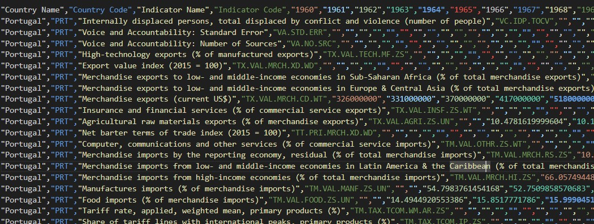

<br>
<div align="center">
  
</div>

# The World Bank Data Pathway

This document is a guide that describes how data for indicators is obtained from the The World Bank Database, as well as the processes for completing and cleaning this data. Although the data insertion scripts may be located in the same common folder as the extraction and transformation scripts, the insertion process will be executed separately from the other steps.
<br><br>

---
## Isolated execution
To execute the data **extraction and transformation scripts** in order to obtain a set of data files ready to be inserted into the database, input the following commands in the terminal:

Set the current directory to the The World Bank folder:
```
cd /path/to/irradiare_app/app/indicators_data/worldbank
```

Execute the main script:
```
python wb_main.py
```

The steps in *wb_main.py* can also be executed individually through their respective scripts.

---

## Process sequence
Brief description of 'The World Bank' data lifecycle:

  1. Both the data file and the metadata file are automatically downloaded within a **single ZIP folder**. Once the ZIP folder is downloaded to its designated path, it is unzipped, and the data and metadata CSV files are extracted and stored **in their respective folders**.
     
  2. The final data files are created by merging the data and metadata for each indicator using the common attribute: **the indicator code**. There is **one final data file per indicator**. Initially, all data and metadata for the indicators were contained in two separate files.

  3. To highlight, the original data file provided **one row per indicator**, with all values for different years in the same row. For example:

  <div align="center">
    
    <br>
    <sub>WB initial data format</sub>
  </div>
  
  <br>
  
  In the final format, the data is reorganized so that each row represents a specific year (timecode). This transformation results in separate files for each dataset (i.e., each distinct indicator code), with the format as follows:

  <div align="center">
    
    <br>
    <sub>WB final data format</sub>
  </div>
  
  <br>
  This restructuring ensures that each row in the final files corresponds to a specific year and indicator, making the data more manageable and easier to analyze.
<br>

---

## INE Folder Structure:
The folder structure **before executing** the program is as follows:

```
ine
    |
    +- data_extraction ........ --> Code to retrieve data and metadata
    |   |
    |   +- ine_api.py ......... --> Code to retrieve INE data and metadata files via API
    |
    +- data_processing ........ --> Code to merge, clean, and complete the raw data files
    |   | 
    |   +- ine_merge_data.py .. --> Code to merge data and metadata files according to the unique id code
    |   |
    |   +- ine_final_data.py .. --> Code to complete the data files previous to the data insertion
    |
    +- data_load .............. --> Code to select and load the desired data to the database(s)
    |   |
    |   +- sqlite_load.py ..... --> Code to insert eredes indicators' data to the SQLite database
    |   |    
    |   +- sqlite_queries.py .. --> Reusable SQL queries for the SQLite data insertion
    |
    +- ine_main.py ............ --> Main script to execute the full INE data extraction and preparation process
```

<br>

**After running** the program, the resulting directory structure, is as follows:

<br>

```
ine
    |
    +- data_extraction ........ --> Code to retrieve data and metadata
    |   |
    |   +- ine_api.py ......... --> Code to retrieve INE data and metadata files via API
    |
    +- data_processing ........ --> Code to merge, clean, and complete the raw data files
    |   | 
    |   +- ine_merge_data.py .. --> Code to merge data and metadata files according to the unique id code
    |   |
    |   +- ine_final_data.py .. --> Code to complete the data files previous to the data insertion
    |
    +- data_load .............. --> Code to select and load the desired data to the database(s)
    |   |
    |   +- sqlite_load.py ..... --> Code to insert eredes indicators' data to the SQLite database
    |   |    
    |   +- sqlite_queries.py .. --> Reusable SQL queries for the SQLite data insertion
    |
    +- ine_main.py ............ --> Main script to execute the full INE data extraction and preparation process
    |
    +- ine_data ............... --> Holds processed, unprocessed data files and complementary files
    |   |
    |   +- ine_comp_files  .... --> Contains complementary files generated along the execution
    |   |
    |   +- processed  ......... --> Contains the final processed data files.
    |   |
    |   +- raw  ............... --> Contains the downloaded/unprocessed data files.
    |
    +- ine_metadata  .......... --> Contains the extracted metadata JSON files
```

<br>

[](https://skillicons.dev)  As explained at the beginning, the `processed` data is selected and inserted into the **SQLite database**.<br>
The source code can be found 'here', while its execution is performed 'here', separately from the extraction and transformation logic.
